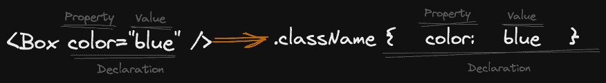

# U

U is a micro-library (<1 KB) to create primitive UI components.



## Key Features

- Micro-libraries (<1 KB)
- Using [React](https://reactjs.org/) or [H](https://github.com/gc-victor/h)
- It uses [c-c](https://github.com/gc-victor/c-c)
- CSS declarations as attributes
- Automatic creation of atomic CSS
- Small API, not much to learn

## Install

You can use pnpm, npm or yarn to install it.

```console
npm install git+https://github.com/gc-victor/u.git#main
```

## Import

Using React

```js
import u from 'u/react';
```


Or import it in a `<script>` as a module.

```html
<script type="module">
    import u from 'https://cdn.jsdelivr.net/gh/gc-victor/u/react/index.js';
</script>
```

Using H

```js
import u from 'u/h';
```

Or import it in a `<script>` as a module.

```html
<script type="module">
    import u from 'https://cdn.jsdelivr.net/gh/gc-victor/u/h/index.js';
</script>
```

## How to use it

### Let's start

React component:

```javascript
// Box.js
import u from 'u/react';

export function Box(props) {
    return u({
        tag: 'div',
        defaultProps: {},
        ...props
    });
}
```

OR with JSX

```javascript
// Box.jsx
import { U } from 'u/react';

export function Box(props) {
    return <U tag="div" { ...props } />;
}
```
```javascript
// App.jsx
export function App() {
    return <Box color="blue">Hello world!</Box>
}
```

H JSX component:

```javascript
// Box.js
import u from 'u/h';

export function Box(props) {
    return u({
        tag: 'div',
        defaultProps: {},
        ...props
    });
}
```

OR with JSX

```javascript
// Box.jsx
import { U } from 'u/h';

export function Box(props) {
    return <U tag="div" { ...props } />;
}
```
```javascript
// App.jsx
export function App() {
    return <Box color="blue">Hello world!</Box>
}
```

H non JSX component:

```javascript
// Box.js
import u from 'u/h';

export function Box(props, children) {
    return u({
        tag: 'div',
        children,
        defaultProps: {},
        ...props
    });
}
// App.js
export function App() {
    return Box({ color: 'blue' }, 'Hello world!');
}
```

### Component API

```javascript
u({
    attributes,
    children,
    defaultProps,
    tag,
    ...props
});
```

- attributes: array of attributes excluded not to convert them to classes
- children: component children
- defaultProps: component default properties
- tag: element tag name, ex. `div`
- props: any other properties defined

You can check the example's folder to have a better overview.

### Build

[esbuild - JSX](https://esbuild.github.io/content-types/#jsx)

```javascript
// esbuild.js
require('esbuild').buildSync({
    entryPoints: ['app.jsx'],
    inject: ['react-shim.js'],
    bundle: true,
    outfile: 'app.js',
});
// react-shim.js
import * as React from 'react';
export { React };
```

[esbuild - Using JSX without React](https://esbuild.github.io/content-types/#using-jsx-without-react)

```javascript
// esbuild.js
require('esbuild').buildSync({
    entryPoints: ['app.jsx'],
    inject: ['h-shim.js'],
    jsxFactory: 'h',
    jsxFragment: 'fragment',
    bundle: true,
    outfile: 'app.js',
});
// h-shim.js
export { fragment, h } from 'u/h/shim';
```

### H dependency

Use [html-element](https://github.com/1N50MN14/html-element) for Server Side Rendering or Static Site Generation.

```console
npm install html-element
```

```javascript
import 'html-element/global-shim';

// Your code ...
```

## Acknowledgments

### Inspiration

-   [Rebass](https://github.com/rebassjs/rebass)
-   [Styled System](https://github.com/styled-system/styled-system)
-   [H](https://github.com/gc-victor/h)
-   [c-c](https://github.com/gc-victor/c-c)

### Tools

-   [esbuild](https://esbuild.github.io/)
-   [gzip-size](https://esbuild.github.io/)
-   [d-d](https://github.com/gc-victor/d-d)
-   [esm](https://github.com/standard-things/esm)
-   [es-module-shims](https://github.com/guybedford/es-module-shims)
-   [jsdom](https://github.com/jsdom/jsdom)
-   [t-t](https://github.com/gc-victor/t-t)
-   [chokidar-cli](https://github.com/kimmobrunfeldt/chokidar-cli)

## Compatible Versioning

### Summary

Given a version number MAJOR.MINOR, increment the:

-   MAJOR version when you make backwards-incompatible updates of any kind
-   MINOR version when you make 100% backwards-compatible updates

Additional labels for pre-release and build metadata are available as extensions to the MAJOR.MINOR format.

[](https://github.com/staltz/comver)

## Contribute

First off, thanks for taking the time to contribute!
Now, take a moment to be sure your contributions make sense to everyone else.

### Reporting Issues

Found a problem? Want a new feature? First of all, see if your issue or idea has [already been reported](../../issues).
If it hasn't, just open a [new clear and descriptive issue](../../issues/new).

### Commit message conventions

A specification for adding human and machine readable meaning to commit messages.

-   [Conventional Commits](https://www.conventionalcommits.org/en/v1.0.0/)

### Submitting pull requests

Pull requests are the greatest contributions, so be sure they are focused in scope and do avoid unrelated commits.

-   Fork it!
-   Clone your fork: `git clone http://github.com/<your-username>/h`
-   Navigate to the newly cloned directory: `cd h`
-   Create a new branch for the new feature: `git checkout -b my-new-feature`
-   Install the tools necessary for development: `npm install`
-   Make your changes.
-   `npm run build` to verify your change doesn't increase output size.
-   `npm test` to make sure your change doesn't break anything.
-   Commit your changes: `git commit -am 'Add some feature'`
-   Push to the branch: `git push origin my-new-feature`
-   Submit a pull request with full remarks documenting your changes.

## License

[MIT License](https://github.com/gc-victor/h/blob/master/LICENSE)

Copyright (c) 2021 Víctor García

Permission is hereby granted, free of charge, to any person obtaining a copy
of this software and associated documentation files (the "Software"), to deal
in the Software without restriction, including without limitation the rights
to use, copy, modify, merge, publish, distribute, sublicense, and/or sell
copies of the Software, and to permit persons to whom the Software is
furnished to do so, subject to the following conditions:

The above copyright notice and this permission notice shall be included in all
copies or substantial portions of the Software.

THE SOFTWARE IS PROVIDED "AS IS", WITHOUT WARRANTY OF ANY KIND, EXPRESS OR
IMPLIED, INCLUDING BUT NOT LIMITED TO THE WARRANTIES OF MERCHANTABILITY,
FITNESS FOR A PARTICULAR PURPOSE AND NONINFRINGEMENT. IN NO EVENT SHALL THE
AUTHORS OR COPYRIGHT HOLDERS BE LIABLE FOR ANY CLAIM, DAMAGES OR OTHER
LIABILITY, WHETHER IN AN ACTION OF CONTRACT, TORT OR OTHERWISE, ARISING FROM,
OUT OF OR IN CONNECTION WITH THE SOFTWARE OR THE USE OR OTHER DEALINGS IN THE
SOFTWARE.
